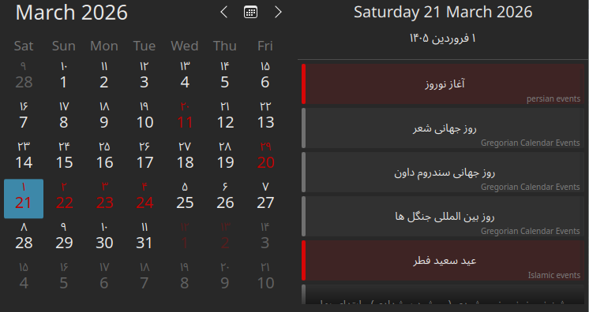

# KDE Jalali Calendar

[فارسی](README.md) | [English]()

This Plasma widget is a calendar and agenda for KDE Plasma. It supports three date systems:

- Gregorian
- Hijri
- Persian / Jalali

You can also connect it to Google Calendar and choose which calendars you want to see.

## Features

- Displays dates in three calendar systems
- Lets you choose which calendars are visible
- Connects to Google Calendar
- Shows events and holidays in calendar and agenda views

## Screenshots

## Settings

From the settings page you can:

- Choose which calendars are shown
- Enable or disable holidays and events
- Manage Google Calendar connection

