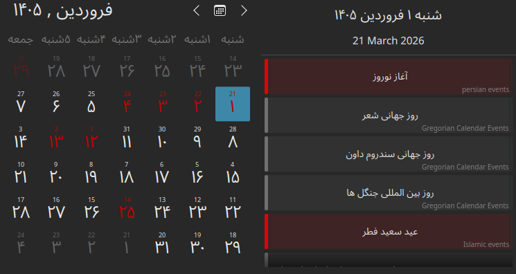
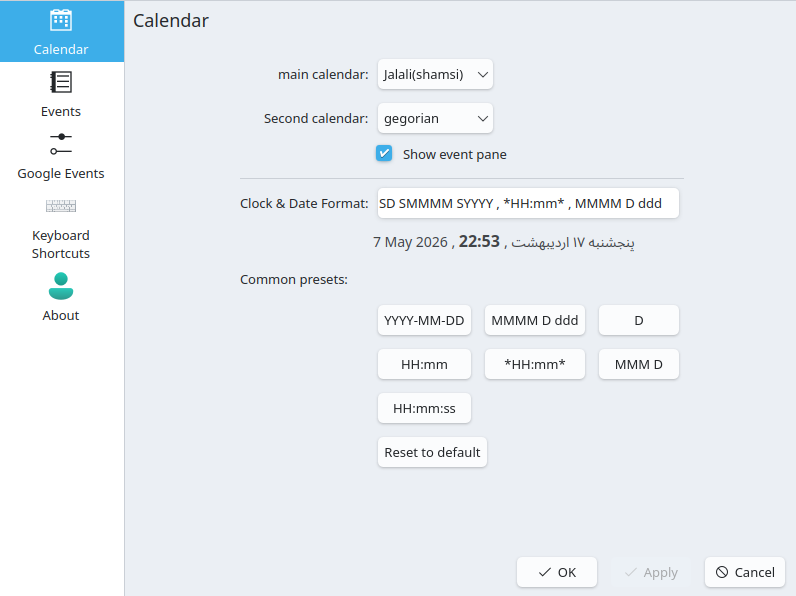

# تقویم جلالی KDE

[فارسی]() | [English](README.en.md)

این پلاسموید یک تقویم و نمای برنامه‌ها برای KDE Plasma است که از سه نوع تاریخ پشتیبانی می‌کند:

- میلادی
- هجری
- شمسی / جلالی

همچنین می‌توانید آن را به Google Calendar متصل کنید و انتخاب کنید کدام تقویم‌ها نمایش داده شوند.

## قابلیت‌ها

- نمایش تاریخ با سه تقویم مختلف
- انتخاب تقویم‌های موردنظر برای نمایش
- اتصال به Google Calendar
- نمایش رویدادها و مناسبت‌ها در نمای تقویم و برنامه روزانه

## تصاویر

## تنظیمات

از بخش تنظیمات می‌توانید:

- نوع تقویم‌های قابل نمایش را انتخاب کنید
- مناسبت‌ها را فعال یا غیرفعال کنید
- اتصال Google Calendar را مدیریت کنید

